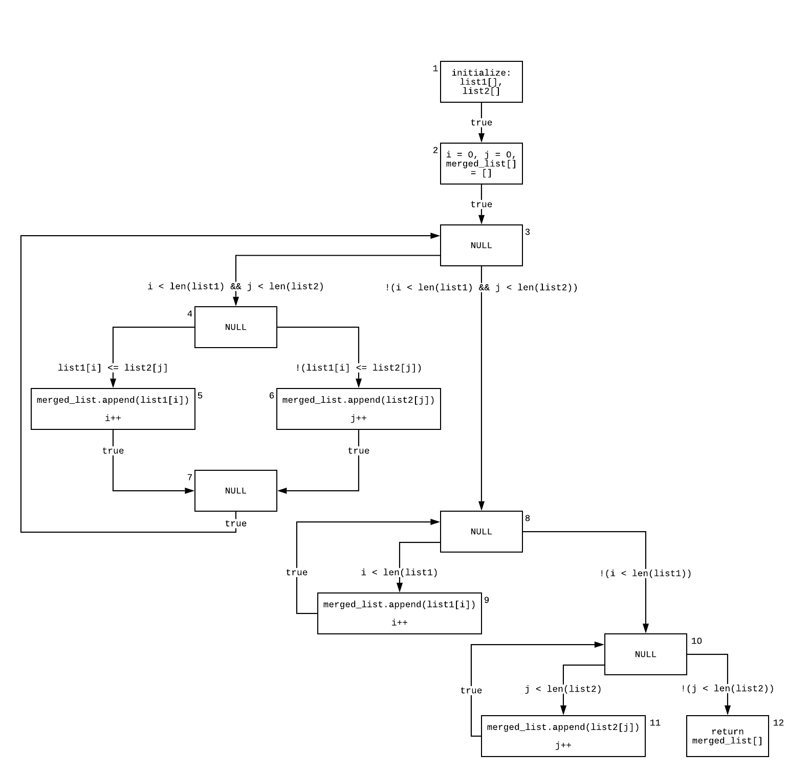

# Data Flow

## `array_merger.py`

```python
__author__ = "Zelin Cai, Patrick Silvestre"
__version__ = "0.1.0"
__license__ = "MIT"

def array_merger(list1, list2):
    """ Variables to iterate through the lists """
    i = j = 0
    merged_list = []
    while i < len(list1) and j < len(list2):
        if list1[i] <= list2[j]:
            merged_list.append(list1[i])
            i += 1
        else:
            merged_list.append(list2[j])
            j += 1

    """ Checks if there are any index values remaining in list1 and appends them """
    while i < len(list1):
        merged_list.append(list1[i])
        i += 1

    """ Has the same purpose as the previous while loop but for list2 instead """
    while j < len(list2):
        merged_list.append(list2[j])
        j += 1

    return merged_list

```

## `test_array_merger.py`

```python
def array_merger(list1, list2):
__author__ = "Zelin Cai, Patrick Silvestre"
__version__ = "0.1.0"
__license__ = "MIT"

from array_merger import *
import unittest


class TestTwoEmptyLists(unittest.TestCase):
    def test_two_empty_lists(self):
        list1 = []
        list2 = []
        expected_output = []
        actual_output = array_merger(list1, list2)
        self.assertEqual(expected_output, actual_output)


class TestOneEmptyList(unittest.TestCase):
    def test_first_list_empty(self):
        list1 = []
        list2 = [0]
        expected_output = [0]
        actual_output = array_merger(list1, list2)
        self.assertEqual(expected_output, actual_output)

    def test_second_list_empty(self):
        list1 = [0]
        list2 = []
        expected_output = [0]
        actual_output = array_merger(list1, list2)
        self.assertEqual(expected_output, actual_output)


class TestFullLists(unittest.TestCase):
    def test_list1_with_leftover_values(self):
        list1 = [3, 4, 5, 6]
        list2 = [0, 1, 2]
        expected_output = [0, 1, 2, 3, 4, 5, 6]
        actual_output = array_merger(list1, list2)
        self.assertEqual(expected_output, actual_output)

    def test_list2_with_leftover_values(self):
        list1 = [0, 1, 2]
        list2 = [3, 4, 5, 6]
        expected_output = array_merger(list1, list2)
        actual_output = array_merger(list1, list2)
        self.assertEqual(expected_output, actual_output)

    def test_same_sized_lists(self):
        list1 = [0, 2, 4]
        list2 = [1, 3, 5]
        expected_output = [0, 1, 2, 3, 4, 5]
        actual_output = array_merger(list1, list2)
        self.assertEqual(expected_output, actual_output)

```

## Data Flow Graph



## Independent Paths

### Simple Paths TODO

> _A simple path is a path in which all nodes, except possibly the first and the last, are distinct._

### Loop-Free Paths TODO

> _A loop-free path is a path in which **all** nodes are distinct._

## `def()`, `c-use()`, `p-use()`

> - _Definition: This occurs when a value is moved into the memory location of the variable._
> - _Use: This occurs when the value is fetched from the memory location of the variable_
>   - _C-use: In a c-use, a potentially new value of another variable or of the same variable is produced._
>   - _P-use: This refers to the use of a variable in a predicate controlling the flow of execution._

| Nodes `i` | `def(i)`                    | `c-use(i)`        |
| --------- | --------------------------- | ----------------- |
| **1**     | {`list1[]`, `list2[]`}      | {}                |
| **2**     | {`i`, `j`, `merged_list[]`} | {}                |
| **3**     | {}                          | {}                |
| **4**     | {}                          | {}                |
| **5**     | {`merged_list[]`, `i`}      | {`i`, `list1[i]`} |
| **6**     | {`merged_list[]`, `j`}      | {`j`, `list2[j]`} |
| **7**     | {}                          | {}                |
| **8**     | {}                          | {}                |
| **9**     | {`merged_list[]`, `i`}      | {`i`, `list1[i]`} |
| **10**    | {}                          | {}                |
| **11**    | {`merged_list[]`, `j`}      | {`j`, `list2[j]`} |
| **12**    | {}                          | {`merged_list[]`} |

| Edges (i, j) | predicate(i, j)                       | p-use(i, j)                  |
| ------------ | ------------------------------------- | ---------------------------- |
| **(1, 2)**   | `true`                                | {}                           |
| **(2, 3)**   | `true`                                | {}                           |
| **(3, 4)**   | `i < len(list1) && j < len(list2)`    | {`i`, `list1`, `j`, `list2`} |
| **(4, 5)**   | `list1[i] <= list2[j]`                | {`list1[i]`, `list2[j]`}     |
| **(4, 6)**   | `!(list1[i] <= list2[j])`             | {`list1[i]`, `list2[j]`}     |
| **(5, 7)**   | `true`                                | {}                           |
| **(6, 7)**   | `true`                                | {}                           |
| **(7, 3)**   | `true`                                | {}                           |
| **(3, 8)**   | `!(i < len(list1) && j < len(list2))` | {`i`, `list1`,`j`, `list2`}  |
| **(8, 9)**   | `i < len(list1)`                      | {`i`, `list1`}               |
| **(9, 8)**   | `true`                                | {}                           |
| **(8, 10)**  | `!(i < len(list1))`                   | {`i`, `list1`}               |
| **(10, 11)** | `j < len(list2)`                      | {`j`, `list2`}               |
| **(11, 10)** | `true`                                | {}                           |
| **(10, 12)** | `!(j < len(list2))`                   | {`j`, `list2`}               |

## Def-Use Associations TODO
