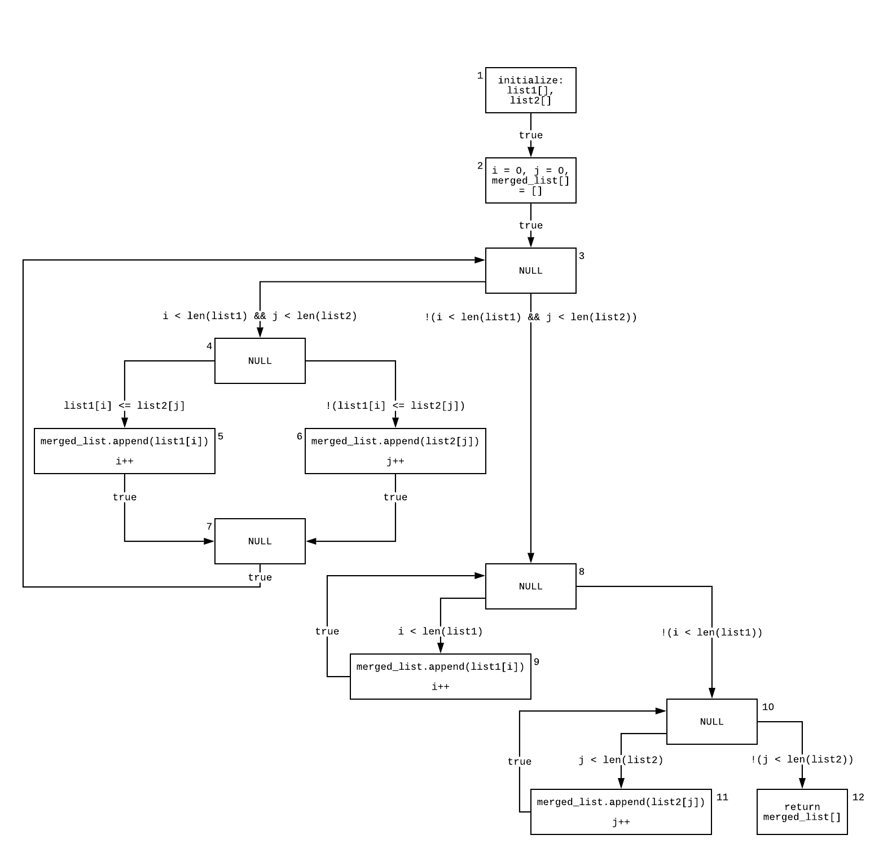

# Data Flow

## `array_merger.py`

```python
__author__ = "Zelin Cai, Patrick Silvestre"
__version__ = "0.1.0"
__license__ = "MIT"

def array_merger(list1, list2):
    """ Variables to iterate through the lists """
    i = j = 0
    merged_list = []
    while i < len(list1) and j < len(list2):
        if list1[i] <= list2[j]:
            merged_list.append(list1[i])
            i += 1
        else:
            merged_list.append(list2[j])
            j += 1

    """ Checks if there are any index values remaining in list1 and appends them """
    while i < len(list1):
        merged_list.append(list1[i])
        i += 1

    """ Has the same purpose as the previous while loop but for list2 instead """
    while j < len(list2):
        merged_list.append(list2[j])
        j += 1

    return merged_list

```

## `test_array_merger.py`

```python
__author__ = "Zelin Cai, Patrick Silvestre"
__version__ = "0.1.0"
__license__ = "MIT"

from array_merger import *
import unittest


class TestTwoEmptyLists(unittest.TestCase):
    def test_01_two_empty_lists(self):
        """
        Nodes:
        1-2-3-8-10-12
        """
        list1 = []
        list2 = []
        expected_output = []
        actual_output = array_merger(list1, list2)
        self.assertEqual(expected_output, actual_output)


class TestOneEmptyList(unittest.TestCase):
    def test_02_first_list_empty(self):
        """
        Nodes:
        1-2-3-8-
            10-11-
            10-12
        """
        list1 = []
        list2 = [0]
        expected_output = [0]
        actual_output = array_merger(list1, list2)
        self.assertEqual(expected_output, actual_output)

    def test_03_second_list_empty(self):
        """
        Nodes:
        1-2-3-
            8-9-
            8-10-12
        """
        list1 = [0]
        list2 = []
        expected_output = [0]
        actual_output = array_merger(list1, list2)
        self.assertEqual(expected_output, actual_output)


class TestFullLists(unittest.TestCase):
    def test_04_list1_with_leftover_values(self):
        """
        Nodes:
        1-2-
            3-4-6-7-
            3-4-6-7-
            3-4-6-7-
            3-
                8-9-
                8-9-
                8-9-
                8-9-
                8-10-12
        """
        list1 = [3, 4, 5, 6]
        list2 = [0, 1, 2]
        expected_output = [0, 1, 2, 3, 4, 5, 6]
        actual_output = array_merger(list1, list2)
        self.assertEqual(expected_output, actual_output)

    def test_05_list2_with_leftover_values(self):
        """
        Nodes:
        1-2-
            3-4-5-7-
            3-4-5-7-
            3-4-5-7-
            3-8-
                10-11-
                10-11-
                10-11-
                10-11-
                10-12
        """
        list1 = [0, 1, 2]
        list2 = [3, 4, 5, 6]
        expected_output = array_merger(list1, list2)
        actual_output = array_merger(list1, list2)
        self.assertEqual(expected_output, actual_output)

    def test_06_same_sized_lists(self):
        """
        Nodes:
        1-2-3-4-5-7-
            3-4-6-7-
            3-4-5-7-
            3-4-6-7-
            3-4-5-7-
            3-4-6-7-8-10-12
        """
        list1 = [0, 2, 4]
        list2 = [1, 3, 5]
        expected_output = [0, 1, 2, 3, 4, 5]
        actual_output = array_merger(list1, list2)
        self.assertEqual(expected_output, actual_output)
```

## Data Flow Graph



## Independent Paths

- Path 1: 1 - 2 - 3 - 8 - 10 - 12

- Path 2: 10 - 11 - 10

- Path 3: 8 - 9 - 8

- Path 4: 2 - 3 - 4 - 5 - 7

- Path 5: 3 - 4 - 6 - 7 - 3

### Simple Paths

Paths 1, 2, 3, 4 and 5 are all simple paths since all of the nodes are distinct aside from the first and last nodes in paths 2, 3 and 5.

### Loop-Free Paths

Paths 1 and 4 are loop-free paths since every node is distinct.

## def(), c-use(), p-use()

| Nodes `i` | `def(i)`                    | `c-use(i)`        |
| --------- | --------------------------- | ----------------- |
| **1**     | {`list1[]`, `list2[]`}      | {}                |
| **2**     | {`i`, `j`, `merged_list[]`} | {}                |
| **3**     | {}                          | {}                |
| **4**     | {}                          | {}                |
| **5**     | {`merged_list[]`, `i`}      | {`i`, `list1[i]`} |
| **6**     | {`merged_list[]`, `j`}      | {`j`, `list2[j]`} |
| **7**     | {}                          | {}                |
| **8**     | {}                          | {}                |
| **9**     | {`merged_list[]`, `i`}      | {`i`, `list1[i]`} |
| **10**    | {}                          | {}                |
| **11**    | {`merged_list[]`, `j`}      | {`j`, `list2[j]`} |
| **12**    | {}                          | {`merged_list[]`} |

| Edges (i, j) | predicate(i, j)                       | p-use(i, j)                  |
| ------------ | ------------------------------------- | ---------------------------- |
| **(1, 2)**   | `true`                                | {}                           |
| **(2, 3)**   | `true`                                | {}                           |
| **(3, 4)**   | `i < len(list1) && j < len(list2)`    | {`i`, `list1`, `j`, `list2`} |
| **(4, 5)**   | `list1[i] <= list2[j]`                | {`list1[i]`, `list2[j]`}     |
| **(4, 6)**   | `!(list1[i] <= list2[j])`             | {`list1[i]`, `list2[j]`}     |
| **(5, 7)**   | `true`                                | {}                           |
| **(6, 7)**   | `true`                                | {}                           |
| **(7, 3)**   | `true`                                | {}                           |
| **(3, 8)**   | `!(i < len(list1) && j < len(list2))` | {`i`, `list1`,`j`, `list2`}  |
| **(8, 9)**   | `i < len(list1)`                      | {`i`, `list1`}               |
| **(9, 8)**   | `true`                                | {}                           |
| **(8, 10)**  | `!(i < len(list1))`                   | {`i`, `list1`}               |
| **(10, 11)** | `j < len(list2)`                      | {`j`, `list2`}               |
| **(11, 10)** | `true`                                | {}                           |
| **(10, 12)** | `!(j < len(list2))`                   | {`j`, `list2`}               |

## Def-Use Associations and Associated Test Cases

(When creating test cases, we attempted to follow the _All du Paths Strategy_.)

### Variable `i`

| du path        | Test Case(s)     | (path)       |
| -------------- | ---------------- | ------------ |
| (i, 2, (3, T)) | 4, 5, 6          | 2-3-4        |
| (i, 2, (3, F)) | 1, 2, 3          | 2-3-8        |
| (i, 2, (4, T)) | 5, 6             | 2-3-4-5      |
| (i, 2, (4, F)) | 4, 6             | 2-3-4-6      |
| (i, 2, 5)      | 5, 6             | 2-3-4-5      |
| (i, 2, (8, T)) | 3, 4             | 2-3-...-8-9  |
| (i, 2, (8, F)) | 1, 2, 3, 4, 5, 6 | 2-3-...-8-10 |
| (i, 2, 9)      | 3, 4             | 2-3-...-8-9  |

### Variable `j`

| du path         | Test Case(s)     | (path)        |
| --------------- | ---------------- | ------------- |
| (j, 2, (3, T))  | 4, 5, 6          | 2-3-4         |
| (j, 2, (3, F))  | 1, 2, 3          | 2-3-8         |
| (j, 2, (4, T))  | 5, 6             | 2-3-4-5       |
| (j, 2, (4, F))  | 4, 6             | 2-3-4-6       |
| (j, 2, 6)       | 4, 6             | 2-3-4-6       |
| (j, 2, (10, T)) | 2, 5             | 2-3-...-10-11 |
| (j, 2, (10, F)) | 1, 2, 3, 4, 5, 6 | 2-3-...-10-12 |
| (j, 2, 11)      | 2, 5             | 2-3-...-11    |
